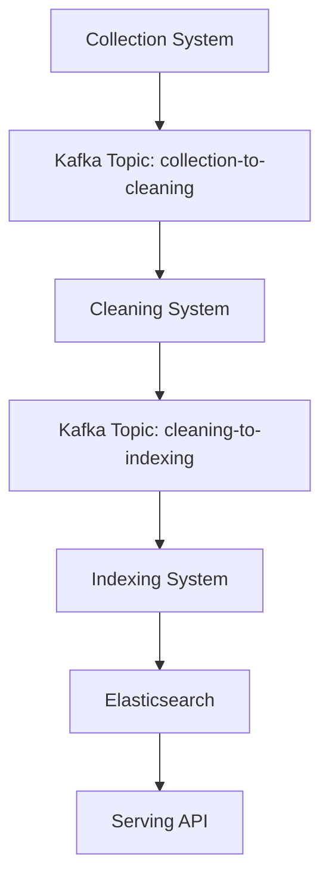
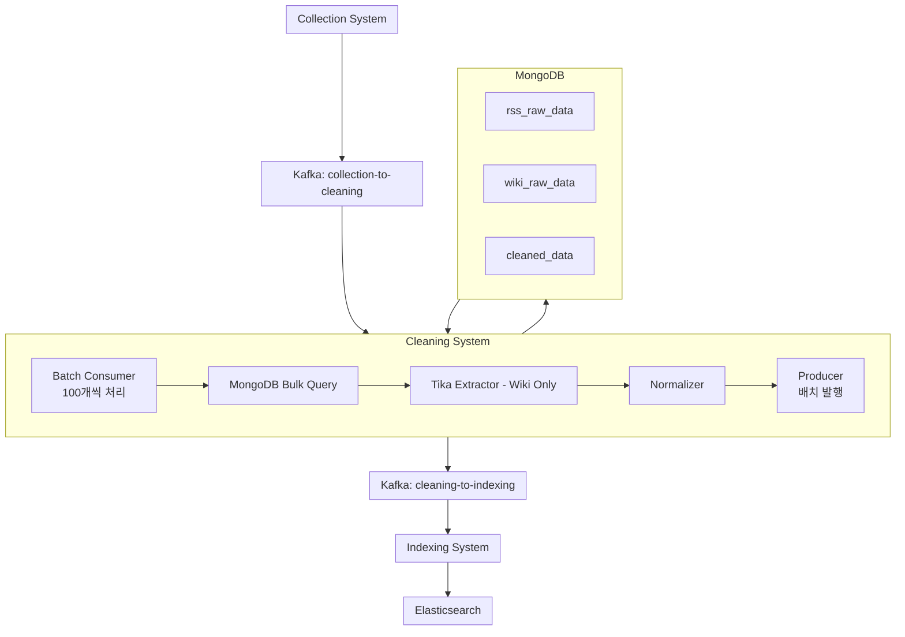
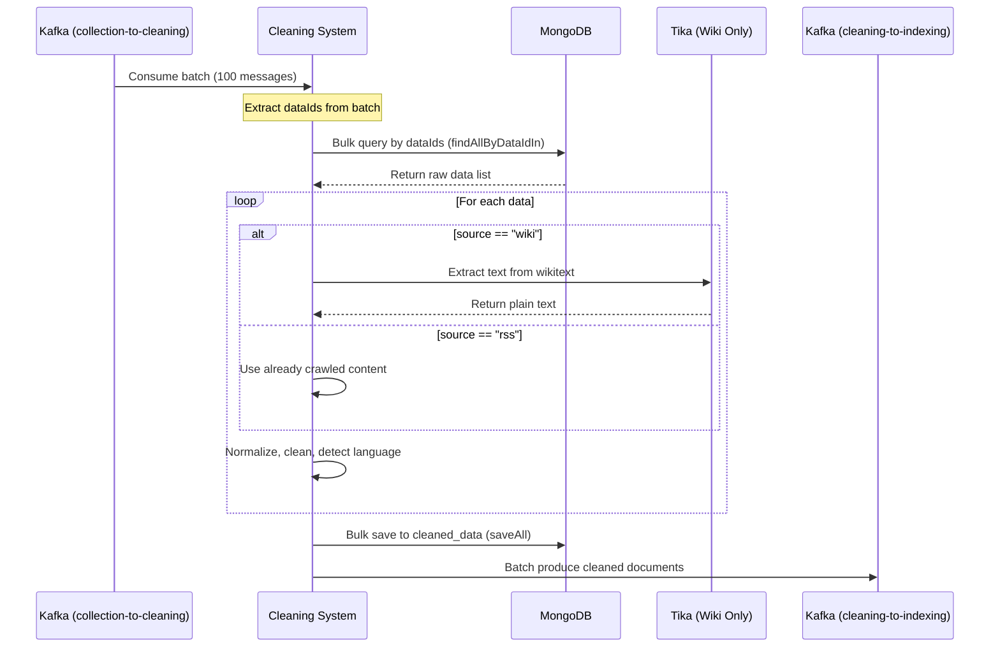
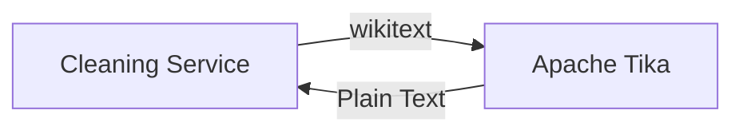
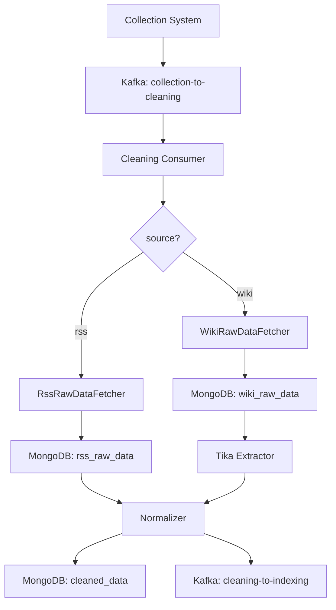

# 🧩 Cleaning System Design

> **Project:** Real-time Search Keyword Service
> **Stage:** Cleaning (정제)
> **Stack:** Kafka · MongoDB · Apache Tika · Spring Boot 3.5.6 · Java 21

---

## 📘 전체 개요



정제(Cleaning) 시스템은 수집된 원본 데이터를 받아
**MongoDB 조회 → Tika 텍스트 추출 (Wiki만) → 데이터 정제 및 정규화 → 색인용 Kafka 토픽 전송**을 담당합니다.

**성능 최적화**: Kafka Batch Listener를 사용하여 메시지를 배치로 처리하고, MongoDB bulk operation으로 처리량을 극대화합니다.

---

## 🧱 시스템 구성도



---

## 🧩 Cleaning System 모듈 구조 (Domain-Driven Design)

```
cleaning-system/
├── domain/                          # 도메인 모델
│   ├── CleanedData.java            # MongoDB 엔티티
│   └── CleanedDataRepository.java
│
├── service/                         # 비즈니스 로직
│   ├── CleaningService.java
│   ├── fetcher/                     # Factory Pattern
│   │   ├── RawDataFetcher.java
│   │   ├── RssRawDataFetcher.java
│   │   └── WikiRawDataFetcher.java
│   └── processor/
│       ├── TextProcessor.java
│       └── WikiTextExtractor.java   # Tika 통합
│
├── kafka/                           # Kafka 통합
│   ├── consumer/
│   │   └── CleaningConsumer.java
│   └── producer/
│       └── CleaningProducer.java
│
└── config/                          # 설정
    ├── MongoConfig.java
    └── TikaConfig.java
```

---

## 🔄 처리 파이프라인



---

## 🧾 Kafka 메시지 스키마 (JSON)

### 📥 `collection-to-cleaning` (입력)
```json
{
  "version": "1.0",
  "messageId": "550e8400-e29b-41d4-a716-446655440000",
  "timestamp": "2025-10-28T10:00:00",
  "eventType": "DATA_COLLECTED",
  "payload": {
    "dataId": "abc123def456...",
    "source": "rss",
    "mongoCollectionName": "rss_raw_data",
    "priority": "NORMAL",
    "sourceDetails": {
      "strategyName": "조선일보",
      "title": "뉴스 제목",
      "url": "https://www.chosun.com/...",
      "author": "기자명",
      "publishedAt": "2025-10-28T09:00:00"
    }
  },
  "retryCount": 0
}
```

**Wiki 예시:**
```json
{
  "version": "1.0",
  "messageId": "550e8400-e29b-41d4-a716-446655440001",
  "timestamp": "2025-10-28T10:00:00",
  "eventType": "DATA_COLLECTED",
  "payload": {
    "dataId": "def789ghi012...",
    "source": "wiki",
    "mongoCollectionName": "wiki_raw_data",
    "priority": "NORMAL",
    "sourceDetails": {
      "namespace": "0",
      "title": "대한민국",
      "pageId": "12345",
      "revisionId": "67890",
      "timestamp": "2025-10-20T15:30:00"
    }
  },
  "retryCount": 0
}
```

### 📤 `cleaning-to-indexing` (출력)
```json
{
  "version": "1.0",
  "messageId": "650e8400-e29b-41d4-a716-446655440000",
  "timestamp": "2025-10-28T10:05:00",
  "eventType": "DATA_CLEANED",
  "payload": {
    "dataId": "abc123def456...",
    "source": "rss",
    "title": "뉴스 제목",
    "cleanedContent": "정제된 본문 텍스트...",
    "language": "ko",
    "metadata": {
      "originalLength": 5000,
      "cleanedLength": 4500,
      "strategyName": "조선일보",
      "url": "https://www.chosun.com/..."
    },
    "processedAt": "2025-10-28T10:05:00"
  },
  "retryCount": 0
}
```

---

## ⚙️ Tika 연동 구조 (Wiki 전용)



**처리 방식**:
- **RSS**: 이미 Collection System에서 Jsoup으로 본문 크롤링 완료 → **Tika 사용 안 함**
- **Wiki**: wikitext 형식 → **Tika로 plain text 추출**

---

## 🧮 중복 제거 전략

**Collection System에서 이미 처리**:
- Collection이 SHA-256 기반 `dataId`로 중복 제거
- MongoDB unique index로 보장
- **Cleaning은 별도 중복 제거 불필요**

**Idempotent 보장**:
- 동일 `dataId` 재처리 시 `cleaned_data` upsert
- Kafka 재시도 시에도 안전

---

## 🧰 운영 및 모니터링

| 항목 | 도구 | 지표 예시 |
|------|------|-----------|
| 모니터링 | Prometheus / Grafana | 처리량, MongoDB 조회 latency, Tika latency, DLQ 비율 |
| 로깅 | Logback → File / Console | 데이터별 처리 상태 로그 |
| 알림 | (향후) | DLQ 급증, MongoDB 장애, Tika 오류 등 |

---

## 🛠️ 장애 대응 정책

| 상황 | 조치 |
|------|------|
| MongoDB 조회 실패 | 3회 재시도 + DLQ 전송 |
| Tika 오류 (Wiki) | 타임아웃 + 백오프 재시도 → DLQ |
| Kafka Consumer Lag | Cleaning 인스턴스 확장 (Horizontal Scaling) |
| 정규화 실패 | 로그 기록 + DLQ 전송 |
| Kafka Producer 실패 | 3회 재시도 + DLQ 전송 |

---

## 🚀 확장 및 배포

- **Horizontal Scaling**: Kafka partition 수에 맞춰 Cleaning 인스턴스 확장
- **Docker 컨테이너**: Spring Boot 애플리케이션 컨테이너화
- **배포 환경** (향후):
  - `Docker Compose` (개발/테스트)
  - `Kubernetes` (프로덕션)
  - Secrets 관리 (Kafka/MongoDB credentials)

---

## 🧠 기술 스택 요약

| 분류 | 기술 |
|------|------|
| Framework | Spring Boot 3.5.6 |
| Language | Java 21 |
| Build Tool | Gradle |
| Messaging | Apache Kafka (JSON 직렬화) |
| Database | MongoDB (원본 조회, 정제 결과 저장) |
| Text Extraction | Apache Tika (Wiki 전용) |
| Language Detection | (향후) OpenNLP / langdetect |
| Deployment | Docker |

---

## 📈 MongoDB 조회 전략

### Collection별 조회 방식 (Factory Pattern + Bulk Operation)

```java
// Factory Pattern 사용 - 배치 처리 지원
public interface RawDataFetcher {
    RawDataContent fetchContent(String dataId);
    List<RawDataContent> fetchContentBatch(List<String> dataIds);  // 배치 조회
}

// RSS 조회
public class RssRawDataFetcher implements RawDataFetcher {
    public RawDataContent fetchContent(String dataId) {
        RssRawData rawData = rssRawDataRepository.findByDataId(dataId);
        return new RawDataContent(
            rawData.getRssItem().getTitle(),
            rawData.getRssItem().getContent(),  // 이미 크롤링됨
            rawData.getRssItem().getUrl()
        );
    }

    // 배치 조회 (성능 최적화)
    public List<RawDataContent> fetchContentBatch(List<String> dataIds) {
        List<RssRawData> rawDataList = rssRawDataRepository.findAllByDataIdIn(dataIds);
        return rawDataList.stream()
            .map(raw -> new RawDataContent(
                raw.getRssItem().getTitle(),
                raw.getRssItem().getContent(),
                raw.getRssItem().getUrl()
            ))
            .toList();
    }
}

// Wiki 조회
public class WikiRawDataFetcher implements RawDataFetcher {
    public RawDataContent fetchContent(String dataId) {
        WikiRawData rawData = wikiRawDataRepository.findByDataId(dataId);
        String wikitext = rawData.getWikiPage().getRevision().getText().getContent();

        // Tika로 변환
        String plainText = tikaExtractor.extract(wikitext);

        return new RawDataContent(
            rawData.getTitle(),
            plainText,
            null  // Wiki는 URL 없음
        );
    }

    // 배치 조회 (성능 최적화)
    public List<RawDataContent> fetchContentBatch(List<String> dataIds) {
        List<WikiRawData> rawDataList = wikiRawDataRepository.findAllByDataIdIn(dataIds);
        return rawDataList.stream()
            .map(raw -> {
                String wikitext = raw.getWikiPage().getRevision().getText().getContent();
                String plainText = tikaExtractor.extract(wikitext);
                return new RawDataContent(raw.getTitle(), plainText, null);
            })
            .toList();
    }
}
```

### 처리 흐름



---

## ⚡ 성능 최적화 전략

### Kafka Batch Listener
```yaml
spring:
  kafka:
    consumer:
      group-id: cleaning-group
      max-poll-records: 100          # 한 번에 100개 메시지 처리
      fetch-min-size: 1048576        # 1MB 이상 모아서 처리
      auto-offset-reset: earliest
```

### MongoDB Bulk Operation
```java
// Repository에 배치 조회 메서드 추가
public interface RssRawDataRepository extends MongoRepository<RssRawData, String> {
    List<RssRawData> findAllByDataIdIn(List<String> dataIds);
}

public interface WikiRawDataRepository extends MongoRepository<WikiRawData, String> {
    List<WikiRawData> findAllByDataIdIn(List<String> dataIds);
}

// Service에서 배치 저장
cleanedDataRepository.saveAll(cleanedDataList);  // Bulk insert
```

### MongoDB Connection Pool
```yaml
spring:
  data:
    mongodb:
      connection-pool:
        max-size: 50
        min-size: 10
```

### 성능 지표 (예상)
| 항목 | 단일 처리 | 배치 처리 (100개) |
|------|----------|------------------|
| MongoDB 조회 | 100회 | 1회 |
| MongoDB 저장 | 100회 | 1회 |
| Throughput | 20 msg/sec | 200-500 msg/sec |
| Latency | ~100ms/msg | ~5-10초/batch |

### 확장 전략
```
Kafka Topic: collection-to-cleaning (10 partitions)
    ↓
Cleaning Consumer Instance 1 (partition 0)
Cleaning Consumer Instance 2 (partition 1)
...
Cleaning Consumer Instance 10 (partition 9)
```

---

## 🧭 구현 계획

### Phase 1: 도메인 레이어 ✅
- [x] CleanedData 엔티티
- [x] CleanedDataRepository
- [x] RawDataView 엔티티 (RSS, Wiki)

### Phase 2: Fetcher 레이어 (Factory Pattern) ✅
- [x] RawDataFetcher 인터페이스
- [x] RssRawDataFetcher 구현
- [x] WikiRawDataFetcher 구현
- [x] RawDataFetcherFactory

### Phase 3: Processor 레이어 ✅
- [x] WikiTextExtractor (Tika 연동)
- [x] TextNormalizer (정규화)
- [x] LanguageDetector (언어 감지)

### Phase 4: Service 레이어 ✅
- [x] CleaningService (orchestration)
- [x] CleaningServiceTest (10개 테스트 케이스)

### Phase 5: Kafka 통합 ✅
- [x] KafkaConfig (Consumer & Producer)
- [x] CleaningConsumer (Batch Listener)
- [x] CleaningProducer (Batch 발행)
- [x] application.properties 설정
- [ ] DLQ 처리 (향후 구현 예정)

### Phase 6: Config & 통합 테스트 (진행 예정)
- [x] TikaConfig
- [ ] MongoConfig (선택 사항)
- [ ] 통합 테스트 (Consumer → Service → Producer)
- [ ] Kafka 연동 테스트
- [ ] MongoDB 연동 테스트

---

> **Project:** Real-time Search Keyword Service
> **Version:** 2.0.0
> **Last Updated:** 2025-11-08
> **Implementation Status:** Phase 5 완료 (Kafka Integration)
